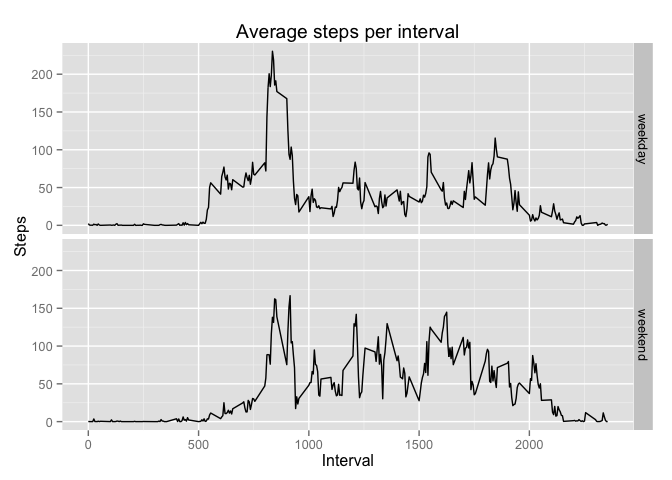

# Reproducible Research: Peer Assessment 1


## Loading and preprocessing the data

```r
# unzip and read file
unzip("activity.zip")
activity <- read.csv("activity.csv", stringsAsFactors=FALSE)
# change class for column date
activity$date <- as.Date(strptime(activity$date, "%Y-%m-%d"))
# set locale to English
Sys.setlocale("LC_TIME", "C")
```

## What is mean total number of steps taken per day?

```r
# calculate and plot total steps per day
actday <- aggregate(steps~date, activity, sum)
plot(actday$date, actday$steps, type="h", main="Total steps per day", xlab="Date", ylab="Steps")
```

 

```r
# calculate the average total steps per day
mean(actday$steps)
```

```
## [1] 10766.19
```

```r
# calculate the median of total steps per day
median(actday$steps)
```

```
## [1] 10765
```

## What is the average daily activity pattern?

```r
# calculate and plot average steps per interval
actinterval <- aggregate(steps~interval, activity, mean)
plot(actinterval$interval, actinterval$steps, type="l", main="Average steps per interval", xlab="Interval", ylab="Steps")
```

 

```r
# which interval contains the maximum number of steps
actinterval$interval[actinterval$steps==max(actinterval$steps)]
```

```
## [1] 835
```

## Imputing missing values

```r
# how many rows in the data set include NAs?
incompleterows <- sum(!complete.cases(activity))
print(incompleterows)
```

```
## [1] 2304
```

The dataset includes 2304 incomplete rows. 
In order to fill the missing values we can use the average steps for a given interval.  
This way it is taken into consideration that the number of steps changes during the course of the day (e.g. during night time the number of steps might be smaller than during daytime).


```r
activity_complete <- activity
# check for each row in the data frame whether column steps is not filled
for (i in 1:nrow(activity_complete)) {
    if (is.na(activity_complete$steps[i])) {
        # if there are no steps then fill in the average number of steps for that interval
        activity_complete$steps[i] <- actinterval$steps[actinterval$interval==activity_complete$interval[i]]
    }
}

# calculate and plot total steps per day
actday_comp <- aggregate(steps~date, activity_complete, sum)
plot(actday_comp$date, actday_comp$steps, type="h", main="Total steps per day", xlab="Date", ylab="Steps")
```

 

```r
# calculate the average total steps per day
mean(actday_comp$steps)
```

```
## [1] 10766.19
```

```r
# calculate the median of total steps per day
median(actday_comp$steps)
```

```
## [1] 10766.19
```

The mean and the median do not differ a lot from their estimates in the first part of this assignment - the mean is the same and the median is close to the original estimate.  
The reason for this is that the missing values were replaced with average values from the other data.  
Before data was missing for 8 different dates for all intervals. 
As average values were included each of these 8 dates now has the average number of daily steps.
For that reason the average of total steps per day did not change.
And the median was moved from "close to the mean" to the mean.  


## Are there differences in activity patterns between weekdays and weekends?

```r
# introduce new column that includes whether the date belongs to a weekend or to a weekday
for (i in 1:nrow(activity_complete)) {  
    if (weekdays(activity_complete$date[i]) %in% c("Saturday", "Sunday")) {
        activity_complete$weekday[i] <- "weekend"
    } else {
        activity_complete$weekday[i] <- "weekday"
    }
}
# make column weekday a factor
activity_complete$weekday <- as.factor(activity_complete$weekday)

# calculate and plot average steps per interval - for weekdays and weekends
actinterval_comp <- aggregate(steps~interval+weekday, activity_complete, mean)
library(ggplot2)
qplot(interval, steps, data=actinterval_comp, facets=weekday~., 
      xlab="Interval", ylab="Steps", main="Average steps per interval", geom = "line")
```

 

